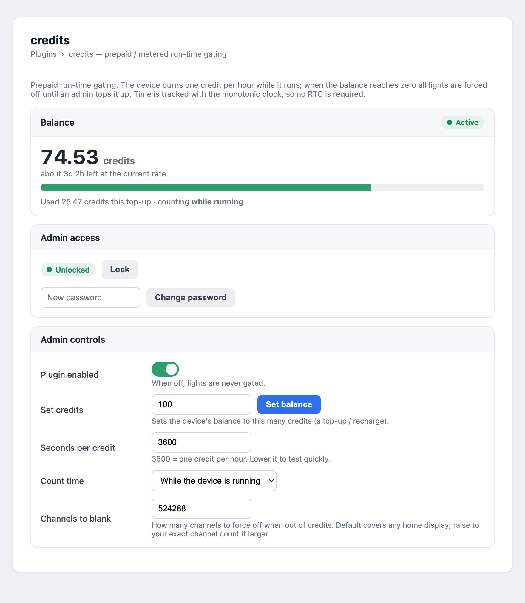

# credits — prepaid / metered run-time gating for FPP

An FPP channel-data plugin that turns a Falcon Player device into a **prepaid /
rental** display. The device is granted a balance of **credits**; while `fppd`
runs it burns **one credit per hour** (configurable). When the balance hits
**zero, all light output is forced off** until a password-protected admin tops it
up. The admin can also enable/disable the plugin entirely.

Works on any FPP **5.4 → 9.x** from one source (same approach as
[pixelfx](https://github.com/joeskolengaden/pixelfx) /
[pixelpulse](https://github.com/joeskolengaden/pixelpulse)).



## Quick install (in FPP)

**Plugins → Add / Manage Plugins → install from URL**, and paste:

```
https://raw.githubusercontent.com/joeskolengaden/credits/main/pluginInfo.json
```

> On **FPP 5.x** you must paste the **raw** URL exactly as above — 5.x does not
> rewrite a GitHub `blob` link to `raw` for you. FPP 6+ accepts either. After it
> installs, restart fppd so the compiled `.so` loads (see [Install](#install)).

## How it works

- **No RTC required.** The target SBCs often have no real-time clock and their
  wall-clock time can't be trusted (wrong at boot, jumps when NTP syncs). The
  plugin measures elapsed time with `std::chrono::steady_clock`
  (`CLOCK_MONOTONIC`), which counts seconds since boot and is immune to the wall
  clock being absent or jumping. Credits therefore accrue **only while the device
  is actually running** — a true per-running-hour meter.
- **Durable balance.** The remaining balance is persisted to
  `config/credits_state.txt` (throttled to limit SD-card wear: every 60s, on each
  whole-credit boundary, on hitting zero, and at shutdown) so it survives reboots.
- **Enforcement.** A background worker thread tracks time, decrements the balance,
  and sets a "blocking" flag when it reaches zero. In `modifyChannelData` (the
  last stage before output) the plugin then `memset`s the channel buffer to 0, so
  nothing lights up — including test patterns — until recharged.
- **Live UI.** fppd writes `/dev/shm/credits_status.json` (RAM, no SD wear, and
  readable across the web server's `PrivateTmp` namespace) which the settings page
  polls for the balance, status, and time remaining.

## Settings (config/plugin.credits)

| Key | Default | Meaning |
| --- | --- | --- |
| `enabled` | `false` | Master switch. Off = lights never gated. |
| `seconds_per_credit` | `3600` | How long one credit lasts (3600 = 1/hour). Lower to test. |
| `count_mode` | `running` | `running` = burn whenever the device is on; `playing` = only while a sequence plays. |
| `blank_channels` | `524288` | How many channels to force to 0 when out of credits. Covers any home display; raise to your exact channel count if larger. |
| `recharge_value` / `recharge_token` | — | Top-up handshake. The UI writes a value + a fresh token; the plugin sets the balance to the value **once** per new token. |
| `admin_password_hash` | — | bcrypt hash of the admin password (set from the UI). Never stores plaintext. |

## Admin & security model

Setting the balance, enabling/disabling, and changing settings are **password
-gated in the web UI** (`action.php`, bcrypt via PHP `password_hash`/`password_verify`,
session-based unlock). On first run no password is set — set one immediately.

**Honest limitation:** the gate is enforced by the plugin's UI. Anyone with full
FPP admin or SSH access to the device can edit the settings file directly and
bypass it. For real enforcement, also protect FPP itself (UI password / isolate
the network). The credit *balance* lives in an fppd-owned file, not in the
settings, so a casual settings edit won't grant credits — only a valid
recharge token will.

## Install

Copy this folder to the device at `/home/fpp/media/plugins/credits/`, then:

```bash
cd /home/fpp/media/plugins/credits
scripts/fpp_install.sh        # builds libcredits.so against /opt/fpp
```

Then restart fppd so it loads the `.so`:

```bash
curl http://<device>/api/system/fppd/restart
```

Or install via URL in FPP (Plugins → add). On **FPP 5.x paste the RAW url**
(5.x doesn't rewrite github blob→raw):
`https://raw.githubusercontent.com/joeskolengaden/credits/main/pluginInfo.json`

## Testing tip

Set **Seconds per credit** to e.g. `60` and **Set credits** to `1`: the lights
should go dark about a minute later. Recharge to bring them back.
